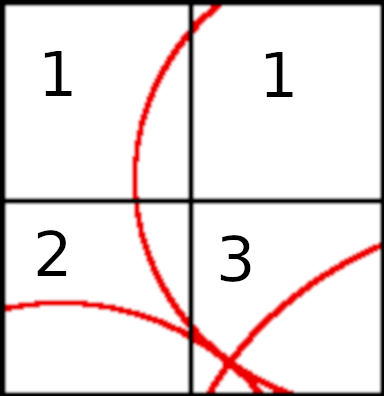

.. HW4 documentation master file, created by
   sphinx-quickstart on Fri Oct 19 13:31:40 2018.
   You can adapt this file completely to your liking, but it should at least
   contain the root `toctree` directive.

Welcome to HW4's documentation!
===============================

.. toctree::
   :maxdepth: 2
   :caption: Contents:

Indices and tables
==================

* :ref:`genindex`
* :ref:`modindex`
* :ref:`search`

**Homework 4**
==============================

Kyle MacMillan

**Text Addition - Better Beacon Grid Robot Finding**
====================

Another way you can track down the location of a robot given multiple beacons 
is to check regions of the field in a recursive manner. If you assume the 
largest area of `min(beacon.x)` to `max(beacon.x)`, `min(beacon.y)` to 
`max(beacon.y)`, and `min(beacon.z)` to `max(beacon.z)` you will have a 
rectangular parallelepiped field. If you chop the field in half in the `x`, `y`, 
and `z` planes you will be left with 8 equal sized rectangular parallelepiped 
octants. You don't have to choose based on the beacons, the size is 
arbitrary, all that matters is that the field is a hyperrectangle. The field is 
shown via :numref:`detection` in 2D for simplification.

.. _detection:
.. figure:: detection1.png

Evaluate each quadrant for intersections. If a quadrant has `len(beacon)` 
intersections with the beacon radii we need to drill deeper to find the 
next-closest quadrant.

.. _dig:

As can be seen in :numref:`dig` if one of the beacons was larger 
there would have been two quadrants with 3 beacon radii intersections. That 
issue will be addressed later.

The naive approach of checking each discretization is extremly cumbersome. For 
example:
In a `16x16` grid discretization we would have to check `256` grid locations. 

Utilizing the method outlined here you would only have to check 16 locations in 
order to obtain the same level of accuracy:
`log`\ :sub:`2`\ `(16) = 4` transitions `* 4` checks `= 16`

Example 2:
In a `16x16x16` grid discretization we would have to check `4096` grid locations.

Utilzing the method outlined here you would only have to check 32 times in 
order to obtain the same level of accuracy:
`log`\ :sub:`2`\ `(16) = 4` transitions `* 8` checks `= 32`

That means if we drilled through a few more recursions we could obtain much 
higher accuracy than would be possible using the naive grid method. On very 
large fields, lets say 1000m x 1000m x 1000m such as the problems at the end of 
the chapter, that amounts to 1,000,000,000 grid locations utilizing the naive 
method, or 80 with this method. We have a growth factor of 
`log`\ :sub:`2`\ `(n)`, where n is the longest l, w, or h.

If there are only two beacons this method will strugle because as you recurse you 
may find a large number of hits, but they are false positives. 

:numref:`dig` shows that if the beacon in the bottom right had a slightly larger 
radius we would clip the bottom left quadrant. We would have two quadrants with 
three intersecting beacon radii. When each of those quadrants is evaluated the 
left quardrant will find zero quadrants with three beacons so would return as 
complete whereas the right quadrant would find another quadrant and dig deeper.
The orthogonality of beacons helps segment. 

Also, when taken to 3D the overlap is more pronounced. This could still be a 
problem in 2D, but it is a larger problem in 3D. It is possible that with 3 
beacons you have multiple octants with three radii intersections. The way to fix 
this problem is to use a breadth-first search method. We put octants of interest 
into a first-in-first-out (FIFO) queue and then explore them. As the depth 
increases the false positives will drop out, while the robot location becomes 
clearer.

After hitting the desired depth you will be left with one or more octants 
depending on implementation. The centroid of those points is the likely robot 
location.
