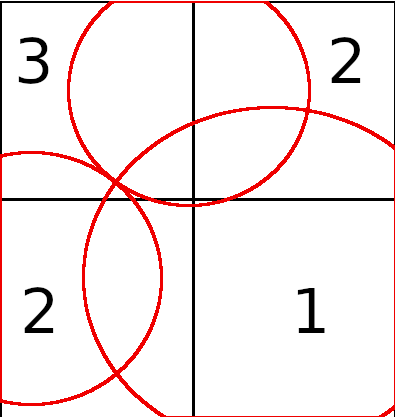
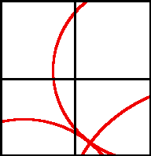

.. HW4 documentation master file, created by
   sphinx-quickstart on Fri Oct 19 13:31:40 2018.
   You can adapt this file completely to your liking, but it should at least
   contain the root `toctree` directive.

Welcome to HW4's documentation!
===============================

.. toctree::
   :maxdepth: 2
   :caption: Contents:

Indices and tables
==================

* :ref:`genindex`
* :ref:`modindex`
* :ref:`search`

**Homework 4**
==============================

Kyle MacMillan

**Text Addition - Better Beacon Robot Finding**
====================

Another way you can track down the location of a robot given multiple beacons 
is to check quadrants of the field recursively. If you assume the largest area 
of `min(beacon.x)` to `max(beacon.x)`, `min(beacon.y)` to `max(beacon.y)` you will have 
a rectanglular field. If you chop the field in half in the `x` and `y` plane you 
will be left with 4 equal sized quadrants.

Evaluate each quadrant for intersections. If a quadrant has `len(beacon)` 
intersections we need to drill deeper to find the next-closest quadrant.

The naive approach of checking each discretization is extremly cumbersome. For 
example:
In a `16x16` grid discretization we would have to check `256` grid locations. 

Utilizing the method outlined here you would only have to check 16 locations in 
order to obtain the same level of accuracy:
`log`\ :sub:`2`\ `(16) = 4` transitions `* 4` checks `= 16`

Example 2:
In a `16x16x16` grid discretization we would have to check `4096` grid locations.

Utilzing the method outlined here you would only have to check 32 times in 
order to obtain the same level of accuracy:
`log`\ :sub:`2`\ `(16) = 4` transitions `* 8` checks `= 32`

That means if we drilled through a few more recursions we could obtain much 
higher accuracy than would be possible using the naive grid method. On very 
large fields, lets say 1000m x 1000m x 1000m such as the problems at the end of 
the chapter, that amounts to 1,000,000,000 grid locations utilizing the naive 
method, or 80 with this method. We have a growth factor of `log`\ :sub:`2`\ `(n)`, where n is 
the longest l, w, or h.

