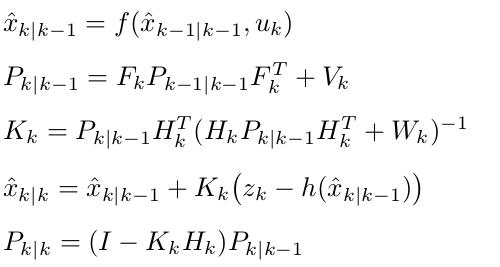

.. Homework 5 documentation master file, created by
   sphinx-quickstart on Mon Nov 26 03:55:55 2018.
   You can adapt this file completely to your liking, but it should at least
   contain the root `toctree` directive.

**Kalman-Takens, Filtering Without a Model**
=============================================

.. Basically a summary of the paper "Ensemble Kalman filtering without a model"
.. This would probably be a good thesis topic for someone down the road, seems powerful

Kalman Filters and Extended Kalman Filters in this course are used for robots 
but as students developing a kit to go out into the world it is important to 
understand that the methods taught here can be applied outside the realm of 
robotics. 

.. I just feel it's necessary to say because EKF use in robots is beat into us

When we do not know how a robot will behave we cannot use KF/EKF because they 
mandate the use of a *model*. Enter `Kalman`_-`Takens`_ (KT). Why would we need 
a model-free version of a Kalman Filter? Because sometimes you cannot model an 
environment, such as when it is dynamic. There is also the matter of robustness. 
As explained earlier, EKF can simply break apart in some cases.

.. I can't figure out how to get a hyphen allowed by rst
.. _Kalman:
.. _Takens: http://math.gmu.edu/~berry/Publications/nomodel.pdf

So what does KT do? KT uses a Kalman Filter to approximate values, then uses 
`Takens method`_ to develop a model. 

.. _Takens method: http://www.crcv.ucf.edu/gauss/info/Takens.pdf

KT will use the step of approximation to feed Takens:

.. It is actually the Ensemble Kalman Filter

.. _step of approximation:

A non-parametric prediction method is then applied to construct a model in order 
to fascilitate filtering.

This method can do *better than models* in some cases. Many models will have 
error, and EKF can fail under model error. A dynamic system or ones such as our 
robot moving and we are not accounting for friction, air resistance, etc. are 
examples of model error. This method can do a *better* job approximating models 
that are more prone to error. For example if your model does not take into 
account a robot driving over **oil**. The model will fall to pieces but KT would 
be robust and adapt to the new model's lower static coefficient of friction 
(loss of traction).

.. This is only scratching the surface, a brief introduction to a powerful topic